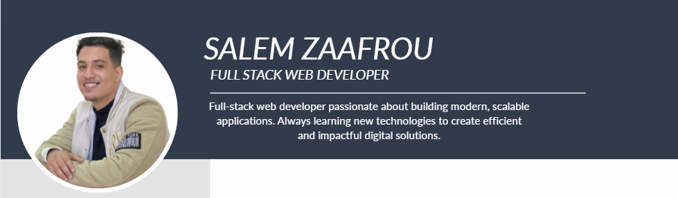

<!-- Banner / Title -->
<h1 align="center">
  Hey there, I'm Salem Zaafrou 👋
</h1>

  

  <b>Full Stack Developer — React.js | Laravel | MySQL | NoSQL</b>

---

<!-- Animated Intro -->
<h3 align="center">
  
</h3>

---

## 🚀 About Me
- 🎓 Étudiant passionné par le développement web  
- 💻 Full stack: **React.js + Laravel + MySQL / MongoDB**  
- ⚡ J'aime créer des applications modernes, rapides et bien structurées  
- 🌍 Basé au Maroc  
- 📬 Email: **salemzaafrou@gmail.com**

---

## 🎨 Tech Stack

### **Frontend**

### **Backend**

 <!-- FIXED -->

### **Database**

---

## 📊 GitHub Stats

---

## 🧩 Languages Used

---

## 🔗 Social Links

---

## ⭐ Thanks for visiting!

  

